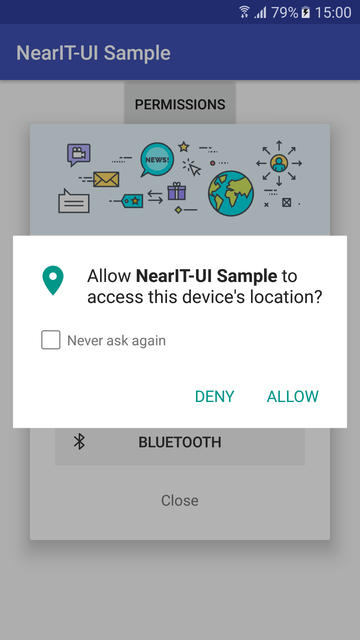

# NearIT-UI for Android
NearIT-UI is an open-source library that provides customizable UI bindings on top of the core [NearIT SDK](https://github.com/nearit/Android-SDK).
This library aims to minimize the effort needed to create the UI for NearIT contents and dialogs.

For example, using NearIT-UI, a developer can launch a dialog to request location/bluetooth permissions to the user by writing a few lines of code.

#### Upcoming features
- Feedback dialog
- Coupon detail
- Coupons list
- Heads up notifications
- Missing permissions alert snackbar

## Configuration
Add the NearIT-UI library dependency. If your project uses Gradle build system, add the following dependency to `build.gradle` of your app:
```groovy
 dependencies {
    //  ...
    compile 'it.nearit.sdk:nearitui:alpha'
 }
```

**Important**: NearIT-UI will only work with NearIT SDK version 2.2.0 or higher.

## NearIt-UI for permissions request
If your app integrates NearIT services you surely want your user to grant your app the location permission. NearIT supports the use of Beacon technology, so bluetooth could be a requirement for your app.

To launch a permission request, your app should start an activity and wait for its result. The activity (`Intent`) is provided by our convenient and customizable builder. It exposes a number of methods that enable a developer to define which permissions are needed and how to request them.

#### Basic example
If you want your app to ask user for both location and bluetooth permissions (and turning on both), you can use the following code:
```java
 // You can choose an arbitrary request code
 private static final int NEAR_PERMISSION_REQUEST = 1000;
 
 // ...
 
 startActivityForResult(
        NearITUIBindings.getInstance(YourActivity.this)
                .createPermissionRequestIntentBuilder()
                .build(),
        NEAR_PERMISSION_REQUEST);
```
In this basic example, both location and bluetooth are required to be granted and turned on: you can check if the request succeded or failed in `onActivityResult(...)` by referring to the same request code.


**Note**: Also app permission to access user location is included in the location request flow (but not screen recorded due to Android limitation on overlay screens)



#### More examples
You can define the permissions request behaviour via our builder.

If your app does not use Beacons technology, you should not ask a user to turn on the Bluetooth adapter. You can achieve this via `noBeacon()` method.
```java
 startActivityForResult(
        NearITUIBindings.getInstance(YourActivity.this)
                .createPermissionRequestIntentBuilder()
                .noBeacon()
                .build(),
        NEAR_PERMISSION_REQUEST);
```

If your app uses Beacons but you consider the bluetooth a non-blocking requirement, just use `nonBlockingBeacon()` method

```java
 startActivityForResult(
        NearITUIBindings.getInstance(YourActivity.this)
                .createPermissionRequestIntentBuilder()
                .nonBlockingBeacon()
                .build(),
        NEAR_PERMISSION_REQUEST);
```

**Note**: Please, keep in mind that calling `nonBlockingBeacon()` and `noBeacon()` will cause no-beacon behaviour.

#### No-UI request
The previous examples can be reproduced without UI. Our `Intent` will cause the opening of system dialogs that ask user for permissions.


In order to kick off this flow without UI you should call `invisibleLayoutMode()` and then the methods needed to define the behaviour of the flow (see [More examples](#more-examples)).

```java
 startActivityForResult(
        NearITUIBindings.getInstance(YourActivity.this)
                .createPermissionRequestIntentBuilder()
                .invisibleLayoutMode()
                // ...
                .build(),
        NEAR_PERMISSION_REQUEST);
```

## UI Customization

If you wish to change the message in the permissions dialog, the existing strings can be overridden by name in your application. See the module's strings.xml file and simply redefine a string to change it:

```xml
<resources>
    <!--    ...   -->
    <string name="nearit_ui_permissions_explanation_text">Your custom string</string>
</resources>
```

The same strategy can be applied to override colors. If you want the buttons to look accordingly to your app style, you can override two resources of NearIT-UI. Just place a selector for the background and one for the text color.

Selector for the background, `drawable/nearit_ui_selector_permission_button` :

```xml
<?xml version="1.0" encoding="utf-8"?>
<selector xmlns:android="http://schemas.android.com/apk/res/android">
    <item android:state_activated="true" android:drawable="@drawable/your_drawable_for_activated_state" />
    <item android:state_pressed="true" android:drawable="@drawable/your_drawable_for_selected_state" />
    <item android:drawable="@drawable/your_drawable_for_normal_state" />
</selector>
```

Selector for the text color, `drawable/nearit_ui_selector_permission_button_text_color` :

```xml
<selector xmlns:android="http://schemas.android.com/apk/res/android">
    <item android:color="@color/your_color_for_activated_state" android:state_activated="true"/>
    <item android:color="@color/your_color_for_pressed_state" android:state_pressed="true"/>
    <item android:color="@color/your_color_for_normal_state"/>
</selector>
```

Image resources can't be overridden. For example, if you wish to replace the header image of the permissions request dialog, you must provide your own image and pass it to the following method of the builder:

```java
 startActivityForResult(
        NearITUIBindings.getInstance(YourActivity.this)
                .createPermissionRequestIntentBuilder()
                // ...
                .setHeaderResourceId(R.drawable.your_image)                                                                                                                                                                                                                                                                        (R.drawable.your_png_image)
                .build(),
        NEAR_PERMISSION_REQUEST);
```

**Note**: The header image width will define the overall width of the dialog. Please notice that images with wrong aspect-ratio can cause an unwanted layout distortion.
The default header dimensions are: `width=300dp` and `height=110dp`. Please consider using the same dimensions.