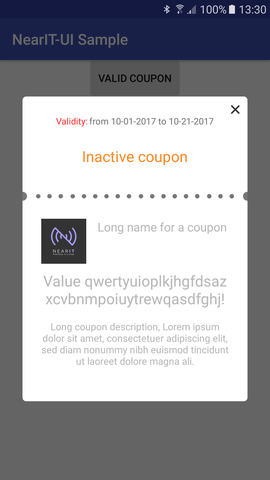
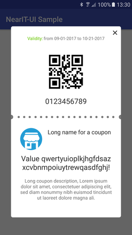

## NearIt-UI for coupon detail pop-up visualization
#### Basic example
If you want your app to display a coupon in a beautiful pop-up dialog, use this simple code:

```java
 // ...
 startActivity(
         NearITUIBindings.getInstance(YourActivity.this)
            .createCouponDetailIntentBuilder()
            .build(coupon));
```

where, `coupon` is an instance of NearIT SDK `Coupon` class. Further information on coupons and other in-app content can be found [here](http://nearit-android.readthedocs.io/en/latest/in-app-content/).






#### Advanced examples
NearIT-UI is shipped with our brand as icon placeholder. If you need to replace it just add one line of code:

```java
  // ...
  startActivity(
          NearITUIBindings.getInstance(YourActivity.this)
             .createCouponDetailIntentBuilder()
             .setIconPlaceholderResourceId(R.drawable.your_drawable)
             .build(coupon));
```

Please, keep in mind that the icon should be a square: a different aspect-ratio can potentially break the layout.

Optionally, you can display the coupon in your custom Activity by adding a Fragment to it. You can get a Fragment via another builder:

```java
  // ...
  Fragment couponFragment = NearITUIBindings.getInstance(YourActivity.this)
        .createCouponDetailFragmentBuilder()
        //  here you can call other methods of the builder
        .build(coupon);
```

Even if our pop-up dialog is well designed, you can try to do a better job by overriding resources (see [UI Customization](##UI-Customization")). As the separator is a PNG file you may want to replace it.

Methods `setSeparatorResourceId(R.drawable.your_separator_drawable)` and `setNoSeparator()` are available for both of the builders.

##UI Customization

