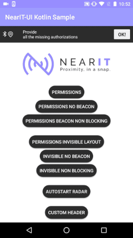

# NearIt-UI for permissions request
If your app integrates NearIT services, you surely want your user to grant your app location permissions. NearIT supports the use of Beacon technology, so bluetooth could also be a requirement for your app.

__Note__: this UI takes care of a variety of scenarios, such as flight mode on, or "never ask again" for a permission.

See [here](#special-scenarios)

#### Basic example
If you want your app to ask user for both location and bluetooth permissions (and turning both on), use the following code:

Java version:
```java
 // You can choose an arbitrary request code
 private static final int NEAR_PERMISSION_REQUEST = 1000;
 
 // ...
 
 startActivityForResult(
        NearITUIBindings.getInstance(YourActivity.this)
                .createPermissionRequestIntentBuilder()
                .build(),
        NEAR_PERMISSION_REQUEST);
```

Kotlin version:
```kotlin
 // You can choose an arbitrary request code
 private val NEAR_PERMISSION_REQUEST: Int = 1000
 
 // ...
 
 startActivityForResult(
        NearITUIBindings.getInstance(this@YourActivity)
                .createPermissionRequestIntentBuilder()
                .build(),
        NEAR_PERMISSION_REQUEST)
```

In this basic example, both location and bluetooth are required to be granted and turned on: you can check if the request succeded or failed in `onActivityResult(...)` by referring to the same request code.


#### Advanced examples
You can define the permissions request behaviour via our builder.

If your app does not use Beacons technology, you should not ask your user to turn Bluetooth on. You can achieve this with the `noBeacon()` method.

Java version:
```java
 startActivityForResult(
        NearITUIBindings.getInstance(YourActivity.this)
                .createPermissionRequestIntentBuilder()
                .noBeacon()
                .build(),
        NEAR_PERMISSION_REQUEST);
```

Kotlin version:
```kotlin
 startActivityForResult(
        NearITUIBindings.getInstance(this@YourActivity)
                .createPermissionRequestIntentBuilder()
                .noBeacon()
                .build(),
        NEAR_PERMISSION_REQUEST)
```

If your app uses Beacons, but you consider the bluetooth a non-blocking requirement, just use `nonBlockingBeacon()` method

Java version:
```java
 startActivityForResult(
        NearITUIBindings.getInstance(YourActivity.this)
                .createPermissionRequestIntentBuilder()
                .nonBlockingBeacon()
                .build(),
        NEAR_PERMISSION_REQUEST);
```

Kotlin version:
```kotlin
 startActivityForResult(
        NearITUIBindings.getInstance(this@YourActivity)
                .createPermissionRequestIntentBuilder()
                .nonBlockingBeacon()
                .build(),
        NEAR_PERMISSION_REQUEST)
```

**Note**: Please, keep in mind that calling both `nonBlockingBeacon()` and `noBeacon()` will cause no-beacon behaviour.

#### No-UI request
The whole permisison request flow, can be started without UI. 



In order to start the permission flow without UI, you should chain `invisibleLayoutMode()` in the builder.

Java version:
```java
 startActivityForResult(
        NearITUIBindings.getInstance(YourActivity.this)
                .createPermissionRequestIntentBuilder()
                .invisibleLayoutMode()
                // ...
                .build(),
        NEAR_PERMISSION_REQUEST);
```

Kotlin version:
```kotlin
 startActivityForResult(
        NearITUIBindings.getInstance(this@YourActivity)
                .createPermissionRequestIntentBuilder()
                .invisibleLayoutMode()
                // ...
                .build(),
        NEAR_PERMISSION_REQUEST)
```

## Special scenarios

We provide a dialog that informs the user if flight-mode is ON or if he chose "Never ask again" on permission request. The dialogs send the user to the right settings screen.


On devices pre-Lollipop (API < 18) BLE technology is not available and some of the Lollipop devices do not have a supported hardware. In those particular cases, we don't ask for bluetooth permission and we hide the bluetooth UI. 

## UI Customization

If you wish to change the message in the permissions dialog, the existing strings can be overridden by name in your application. See the module's strings.xml file and simply redefine a string to change it:

```xml
<resources>
    <!--    ...   -->
    <string name="nearit_ui_permissions_explanation_text">Your custom string</string>
</resources>
```

The same strategy can be applied to override colors. If you want the buttons to look accordingly to your app style, you can override two resources of NearIT-UI. Just place a selector for the background and one for the text color.

Selector for the background, `drawable/nearit_ui_selector_permission_button` :

```xml
<?xml version="1.0" encoding="utf-8"?>
<selector xmlns:android="http://schemas.android.com/apk/res/android">
    <item android:state_activated="true" android:drawable="@drawable/your_drawable_for_activated_state" />
    <item android:state_pressed="true" android:drawable="@drawable/your_drawable_for_selected_state" />
    <item android:drawable="@drawable/your_drawable_for_normal_state" />
</selector>
```

Selector for the text color, `drawable/nearit_ui_selector_permission_button_text_color` :

```xml
<selector xmlns:android="http://schemas.android.com/apk/res/android">
    <item android:color="@color/your_color_for_activated_state" android:state_activated="true"/>
    <item android:color="@color/your_color_for_pressed_state" android:state_pressed="true"/>
    <item android:color="@color/your_color_for_normal_state"/>
</selector>
```

Additionaly, if you wish to replace the header image of the permissions request dialog, you must provide your own image and pass its id to the following method of the builder:

Java version:
```java
 startActivityForResult(
        NearITUIBindings.getInstance(YourActivity.this)
                .createPermissionRequestIntentBuilder()
                // ...
                .setHeaderResourceId(R.drawable.your_image) 
                .build(),
        NEAR_PERMISSION_REQUEST);
```

Kotlin version:
```kotlin
 startActivityForResult(
        NearITUIBindings.getInstance(this@YourActivity)
                .createPermissionRequestIntentBuilder()
                // ...
                .setHeaderResourceId(R.drawable.your_image) 
                .build(),
        NEAR_PERMISSION_REQUEST)
```

**Note**: The header image width will define the overall width of the dialog, but still can't make it smaller than a set minimum. Please notice that images with wrong aspect-ratio can cause an unwanted layout distortion.
The default header dimensions are: `width=300dp` and `height=110dp`. Please consider using the same dimensions.
