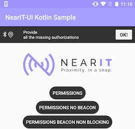
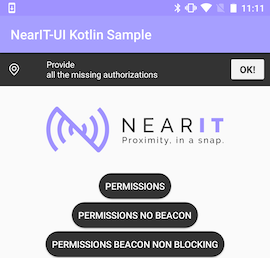
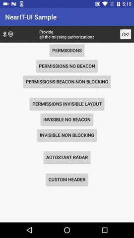

#NearIt-UI for missing permissions alert

Your app should ask the user to grant location permission and to turn on the bluetooth (if your use case implies beacons).

If you want to show a persistent snackbar that alert the user if any permission is missing, this library provides a convenient `View`.
This snackbar visually specifies what is missing (by showing/hiding the two icons) and will automatically hide itself when every permission has been granted.





Add the following xml element where you want to show the snackbar

```xml
<com.nearit.ui_bindings.permissions.views.PermissionSnackbar
        android:id="@+id/permission_snackbar"
        android:layout_width="wrap_content"
        android:layout_height="wrap_content" />
```

and keep a reference in your activity

```java
PermissionSnackbar snackbar = (PermissionSnackbar) findViewById(R.id.permission_snackbar);
```

It is **important** that you pass an Activity reference to the snackbar: by doing this, clicking the snackbar button will cause the launch of the permissions request flow.



To set the activity use the following method:

```java
snackbar.setActivity(this, NEAR_PERMISSION_REQUEST);
```

where `NEAR_PERMISSION_REQUEST` is an int value defined by you that will identify the request.
Then in your activity you should catch the `result` by referring to the same request code.

Because the permissions request flow launched by the `OK!` button is the same provided [here](PERMISSIONS.md), you can customize the behaviour and look.
When you add the xml element you can set some attributes:

```xml
<com.nearit.ui_bindings.permissions.views.PermissionSnackbar
        android:id="@+id/permission_snackbar"
        android:layout_width="wrap_content"
        android:layout_height="wrap_content"
        
        app:noBeacon="true"
        app:invisibleMode="false"
        app:dialogHeader="@drawable/your_drawable"
        />
```

**Note**: the default flow is in a no-UI style (just a cascade of system dialogs)
Please read the permission UI [section](PERMISSIONS.md) of these docs to have a complete view on what you can do with the permissions request.

## UI customization

If you want to change the alert message, add the following attribute to the `PermissionSnackbar` element of your layout:

```xml
<com.nearit.ui_bindings.permissions.views.PermissionSnackbar
        android:id="@+id/permission_snackbar"
        android:layout_width="wrap_content"
        android:layout_height="wrap_content"
        
        app:snackbarAlertText="Your custom alert message"
        
        />
```

The other UI customizations available from xml attributes are:

```xml
<com.nearit.ui_bindings.permissions.views.PermissionSnackbar
        android:id="@+id/permission_snackbar"
        android:layout_width="wrap_content"
        android:layout_height="wrap_content"
        
        app:snackbarBluetoothIcon="@drawable/your_drawable_bt_icon"
        app:snackbarLocationIcon="@drawable/your_drawable_loc_icon"
        
        />
```

and let you change the bluetooth and location icons.

As usual, you can override our string/color/dimen resources by name. Just as a short example, you can change the snackbar colors this way:
```xml
<!--  This is the res/values/colors.xml file of your app
       ...     -->
<color name="nearit_ui_permission_snackbar_background_color">your_color</color>
<color name="nearit_ui_permission_snackbar_alert_text_color">your_color</color>
<color name="nearit_ui_permission_snackbar_button_background_color">your_color</color>
<!--    ...     -->
```